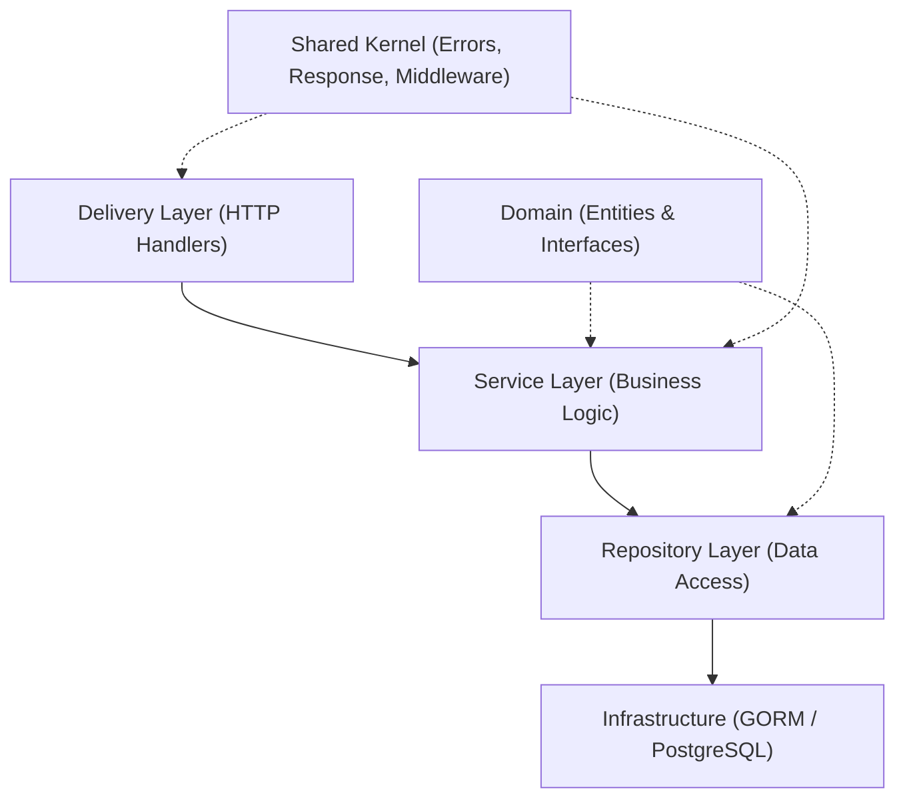

# **GIA Starter App — Clean Architecture**

[](LICENSE)
[](https://github.com/saul-paulus/gia-starter-app-v1)
[](https://golang.org/)
[](https://gin-gonic.com/)

A professional-grade backend starter kit built with **Golang** and **Gin**. Follows **Modular Clean Architecture** — designed for scalability, maintainability, and testability from day one.

---

## 📖 Table of Contents

- [✨ Features](#-features)
- [🛠️ Tech Stack](#️-tech-stack)
- [🏗️ Architecture Overview](#️-architecture-overview)
- [📁 Project Structure](#-project-structure)
- [⚙️ Getting Started](#️-getting-started)
- [📜 Makefile Commands](#-makefile-commands)
- [🌱 Seeding](#-seeding)
- [🛠️ CLI Module Generator](#️-cli-module-generator)
- [📚 API Documentation](#-api-documentation)
- [🧪 Testing](#-testing)
- [📄 License](#-license)

---

## ✨ Features

- **Modular Clean Architecture** — Domain-driven design with clear separation of concerns
- **Dependency Injection** — Decoupled components for easier testing and maintenance
- **RESTful API** — Built with the high-performance Gin framework
- **Database Integration** — Robust GORM setup with PostgreSQL support
- **Automated Migrations** — Versioned schema changes using `sql-migrate`
- **Swagger Documentation** — Self-documenting API using `swag`
- **Structured Logging** — High-performance logging with Uber's `zap`
- **Configuration Management** — Flexible config via Viper (`.env` + YAML)
- **Live Reload** — Faster development cycles with `Air`
- **CLI Module Generator** — Artisan-style scaffolding for new modules
- **Database Seeder** — Automated initial data population
- **Unit Testing** — Repository and service layer tests with `testify` + `sqlmock`

---

## 🚀 Tech Stack

| Component      | Technology                                                                                         | Purpose                               |
| :------------- | :------------------------------------------------------------------------------------------------- | :------------------------------------ |
| **Language**   | [Go 1.25+](https://golang.org/)                                                                    | Core programming language             |
| **Framework**  | [Gin Gonic](https://gin-gonic.com/)                                                                | High-performance HTTP routing         |
| **ORM**        | [GORM](https://gorm.io/)                                                                           | Database interaction and mapping      |
| **Database**   | [PostgreSQL](https://www.postgresql.org/)                                                          | Relational data persistence           |
| **Migration**  | [sql-migrate](https://github.com/rubenv/sql-migrate)                                               | Database schema version control       |
| **Config**     | [Viper](https://github.com/spf13/viper)                                                            | Multi-format configuration management |
| **Logging**    | [Uber Zap](https://github.com/uber-go/zap)                                                         | Fast, structured logging              |
| **Docs**       | [Swagger](https://github.com/swaggo/swag)                                                          | Automatic API documentation           |
| **Validation** | [Go Validator](https://github.com/go-playground/validator)                                         | Request data validation               |
| **Testing**    | [Testify](https://github.com/stretchr/testify) + [sqlmock](https://github.com/DATA-DOG/go-sqlmock) | Unit testing & DB mocking             |
| **Dev Tool**   | [Air](https://github.com/cosmtrek/air)                                                             | Live reloading during development     |

---

## 🏗️ Architecture Overview

This kit follows **Clean Architecture** principles — business logic stays isolated from frameworks, databases, and transport layers.

### Dependency Flow



### Layer Responsibilities

| Layer               | Directory       | Responsibility                                        |
| :------------------ | :-------------- | :---------------------------------------------------- |
| **HTTP / Delivery** | `http/`         | Bind request, validate, call service, return response |
| **Service**         | `services/`     | Business rules, orchestration, error mapping          |
| **Repository**      | `repositories/` | Database queries via GORM                             |
| **Domain**          | `domain/`       | Entity structs (pure Go, no dependencies)             |
| **DTO**             | `dto/`          | Request/Response data transfer objects                |

---

## 📁 Project Structure

```text
gia-starter-app-V1/
│
├── cmd/                          # Application entry points
│   ├── api/main.go               # HTTP server entry point
│   ├── cli/main.go               # CLI module generator entry point
│   └── seed/main.go              # Database seeder entry point
│
├── internal/                     # Private application code
│   ├── bootstrap/                # App initialization & wiring
│   │   └── bootstrap.go
│   │
│   ├── modules/                  # Feature modules (domain-driven)
│   │   ├── users/                # Users module
│   │   │   ├── domain/           # Entity: Users struct
│   │   │   ├── dto/              # Request DTOs with validation tags
│   │   │   ├── http/             # HTTP handler (CreateUser, Index)
│   │   │   ├── repositories/     # GORM queries
│   │   │   │   └── mocks/        # Mock implementations for unit tests
│   │   │   ├── services/         # Business logic (CreateUser)
│   │   │   └── module.go         # DI wiring: repo → service → handler
│   │   │
│   │   └── auth/                 # Auth module (in progress)
│   │       ├── domain/
│   │       ├── dto/
│   │       ├── http/
│   │       ├── repositories/
│   │       ├── services/
│   │       └── module.go
│   │
│   ├── delivery/http/            # Global router & middleware registration
│   │   └── router.go
│   │
│   ├── infrastructure/           # Technical drivers
│   │   ├── config/config.go      # Viper config loader
│   │   ├── database/postgres.go  # GORM + PostgreSQL connection
│   │   └── logger/zap.go         # Uber Zap logger setup
│   │
│   ├── cli/                      # CLI module generator logic
│   │   ├── make_module.go        # Core scaffolding logic
│   │   └── *_template.go         # Handler / service / repo templates
│   │
│   ├── seeder/                   # Database seeders
│   │   └── user_seeder.go
│   │
│   └── shared/                   # Cross-cutting concerns
│       ├── domain/model/         # Base model (ID, timestamps)
│       ├── errors/errors.go      # AppError & predefined errors
│       ├── middleware/           # Error handler middleware
│       ├── response/response.go  # Standardized API response helpers
│       ├── constant/             # Application-wide constants (reserved)
│       └── util/                 # Utility helpers (reserved)
│
├── configs/                      # Configuration files (YAML)
├── migrations/                   # SQL migration scripts (sql-migrate)
├── pkg/                          # Public shared libraries
│   ├── pagination/               # Pagination helpers
│   └── validator/                # Custom validation rules
├── scripts/                      # Shell scripts for CI/CD (reserved)
├── storage/logs/                 # Application log files
├── docs/                         # Auto-generated Swagger files
└── test/                         # Integration / e2e tests (reserved)
```

---

## ⚙️ Getting Started

### Prerequisites

- **Go 1.21+** installed
- **PostgreSQL** instance running
- **sql-migrate** installed:
  ```bash
  go install github.com/rubenv/sql-migrate/...@latest
  ```
- **swag** installed:
  ```bash
  go install github.com/swaggo/swag/cmd/swag@latest
  ```

### Setup

1. **Clone & Install Dependencies**

   ```bash
   git clone https://github.com/saul-paulus/gia-starter-app-v1.git
   cd gia-starter-app-v1
   go mod tidy
   ```

2. **Configure Environment**

   ```bash
   cp .env.example .env
   # Edit .env — set DB_HOST, DB_USER, DB_PASSWORD, DB_NAME
   ```

3. **Run Migrations**

   ```bash
   make migrate-up
   ```

4. **Seed Initial Data** _(optional)_

   ```bash
   make seed
   ```

5. **Run the Application**

   ```bash
   # Standard
   go run cmd/api/main.go

   # With hot-reload (recommended for development)
   air
   ```

The server starts at **`http://localhost:8081`**.

---

## 📜 Makefile Commands

| Command                     | Description                                |
| :-------------------------- | :----------------------------------------- |
| `make migrate-status`       | Show current migration status              |
| `make migrate-up`           | Apply all pending migrations               |
| `make migrate-down`         | Roll back the most recent migration        |
| `make migrate-new name=...` | Create a new timestamped migration file    |
| `make make-module name=...` | Scaffold a new module (Clean Architecture) |
| `make seed`                 | Seed the database with default data        |

---

## 🌱 Seeding

Populate your database with initial data (e.g., default admin user):

```bash
make seed
```

This will:

- Load configurations from `configs/config.yaml` and `.env`
- Check if the default user already exists
- Create a default user if not present

> [!NOTE]
> Run `make migrate-up` **before** running the seeder to ensure the schema is up to date.

---

## 🛠️ CLI Module Generator

Scaffold a new module with a single command:

```bash
make make-module name=product
```

This generates a full Clean Architecture structure:

```text
internal/modules/product/
├── http/product_handler.go           # HTTP handler
├── services/product_service.go       # Business logic
├── repositories/product_repository.go # Data access (GORM)
├── domain/                           # Entity structs
├── dto/                              # Request DTOs
└── module.go                         # DI wiring & route registration
```

> [!TIP]
> After generating a module, register it in `internal/delivery/http/router.go` by initializing `NewModule(db)` and calling `.Register(v1)`.

---

## 📚 API Documentation

### Swagger UI

Interactive Swagger UI tersedia di:
**[http://localhost:8081/swagger/index.html](http://localhost:8081/swagger/index.html)**

Generate atau update dokumentasi setelah menambahkan endpoint baru:

```bash
~/go/bin/swag init -g cmd/api/main.go --output docs
```

> [!TIP]
> Install `swag` sekali dengan: `go install github.com/swaggo/swag/cmd/swag@latest`

---

### Base URL & Response Format

**Base URL:** `http://localhost:8081/api/v1`

Semua endpoint menggunakan format response yang konsisten:

```json
// ✅ Success
{
  "success": true,
  "response_code": 200,
  "message": "...",
  "data": {}
}

// ❌ Error
{
  "success": false,
  "response_code": 400,
  "message": "...",
  "error": { "code": "ERROR_CODE" }
}
```

---

### API Reference

#### 🟢 System

| Method | Endpoint         | Deskripsi                      |
| :----: | :--------------- | :----------------------------- |
| `GET`  | `/api/v1/health` | Health check — status aplikasi |

**`GET /api/v1/health`**

```json
// 200 OK
{
  "success": true,
  "response_code": 200,
  "message": "Health check OK",
  "data": { "status": "UP OK" }
}
```

---

#### 👤 Users

| Method | Endpoint        | Deskripsi          |
| :----: | :-------------- | :----------------- |
| `GET`  | `/api/v1/users` | Index users module |
| `POST` | `/api/v1/users` | Buat user baru     |

**`POST /api/v1/users`** — Create User

Request Body:

```json
{
  "username": "john_doe",
  "email": "john@example.com",
  "role_id": 2,
  "password": "secretpassword"
}
```

| Field      | Type      | Validasi                        |
| :--------- | :-------- | :------------------------------ |
| `username` | `string`  | required, min=3, max=100        |
| `email`    | `string`  | required, format email, max=254 |
| `role_id`  | `integer` | required, 1=admin, 2=user       |
| `password` | `string`  | required, min=8, max=255        |

Responses:

```json
// 201 Created
{ "success": true, "response_code": 201, "message": "User created successfully" }

// 400 — validasi gagal
{ "success": false, "response_code": 400, "message": "...", "error": { "code": "VALIDATION_ERROR" } }

// 400 — email sudah terdaftar
{ "success": false, "response_code": 400, "message": "Email already registered", "error": { "code": "EMAIL_EXISTS" } }

// 500 — internal error
{ "success": false, "response_code": 500, "message": "an unexpected error occurred", "error": { "code": "INTERNAL" } }
```

---

### Error Codes

| Code               | HTTP | Deskripsi                 |
| :----------------- | :--- | :------------------------ |
| `VALIDATION_ERROR` | 400  | Input request tidak valid |
| `EMAIL_EXISTS`     | 400  | Email sudah terdaftar     |
| `BAD_REQUEST`      | 400  | Request tidak valid       |
| `UNAUTHORIZED`     | 401  | Authentication diperlukan |
| `FORBIDDEN`        | 403  | Akses ditolak             |
| `NOT_FOUND`        | 404  | Resource tidak ditemukan  |
| `INTERNAL`         | 500  | Internal server error     |

---

## 🧪 Testing

### Run All Tests

```bash
go test ./... -v
```

### Run Tests Per Layer

```bash
# Service layer only
go test ./internal/modules/users/services/... -v

# Repository layer only
go test ./internal/modules/users/repositories/... -v

# All users module tests
go test ./internal/modules/users/... -v
```

### Run with Coverage

```bash
go test ./internal/modules/users/... -cover
```

Expected coverage:

- **Repository**: `100%`
- **Service**: `~92%`

### Test Structure

Each module follows this testing convention:

```text
modules/users/
├── services/
│   ├── user_service.go
│   └── user_service_test.go   # Table-driven unit tests (mock repo)
└── repositories/
    ├── user_repository.go
    ├── user_repository_test.go # sqlmock + GORM integration tests
    └── mocks/
        └── user_repository_mock.go  # Manual mock (nil-safe)
```

---

## 📄 License

This project is licensed under the **MIT License**. See the [LICENSE](LICENSE) file for details.
