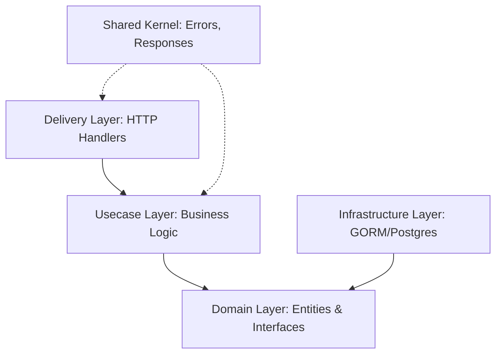

# **GIA Starter App - Clean Architecture**

[](LICENSE)
[](https://github.com/saul-paulus/gia-starter-app-v1)
[](https://golang.org/)
[](https://gin-gonic.com/)

A professional-grade backend starter kit built with **Golang 1.25** and the **Gin Gonic** framework. This project follows the **Modular Clean Architecture** (Hexagonal Architecture) pattern, designed for high scalability, maintainability, and testability.

---

## 📖 Table of Contents

- [✨ Features](#-features)
- [🛠️ Tech Stack](#️-tech-stack)
- [🏗️ Architecture Overview](#️-architecture-overview)
- [📁 Project Structure](#-project-structure)
- [⚙️ Getting Started](#️-getting-started)
- [🔌 API Documentation](#-api-documentation)
- [🧪 Testing](#-testing)
- [📜 Makefile Commands](#-makefile-commands)
- [🐳 Docker](#-docker)
- [🤝 Contributing](#-contributing)
- [📄 License](#-license)

---

## ✨ Features

- **Modular Clean Architecture**: Domain-driven design with clear separation of concerns.
- **Dependency Injection**: Decoupled components for easier testing and maintenance.
- **RESTful API**: Built with the high-performance Gin framework.
- **Database Integration**: Robust GORM setup with PostgreSQL support.
- **Automated Migrations**: Versioned schema changes using `sql-migrate`.
- **Swagger Documentation**: Self-documenting API using `swag`.
- **Structured Logging**: High-performance logging with Uber's `zap`.
- **Configuration Management**: Flexible config via Viper (`.env`, YAML).
- **Live Reload**: Faster development cycles with `Air`.

---

## 🚀 Tech Stack

| Component      | Technology                                                 | Purpose                               |
| :------------- | :--------------------------------------------------------- | :------------------------------------ |
| **Language**   | [Go 1.25+](https://golang.org/)                            | Core programming language             |
| **Framework**  | [Gin Gonic](https://gin-gonic.com/)                        | High-performance HTTP routing         |
| **ORM**        | [GORM](https://gorm.io/)                                   | Database interaction and mapping      |
| **Database**   | [PostgreSQL](https://www.postgresql.org/)                  | Relational data persistence           |
| **Migration**  | [sql-migrate](https://github.com/rubenv/sql-migrate)       | Database schema version control       |
| **Config**     | [Viper](https://github.com/spf13/viper)                    | Multi-format configuration management |
| **Logging**    | [Uber Zap](https://github.com/uber-go/zap)                 | Fast, structured logging              |
| **Docs**       | [Swagger](https://github.com/swaggo/swag)                  | Automatic API documentation           |
| **Validation** | [Go Validator](https://github.com/go-playground/validator) | Request data validation               |
| **Dev Tool**   | [Air](https://github.com/cosmtrek/air)                     | Live reloading during development     |

---

## 🛠️ Getting Started

### Prerequisites

- **Go 1.25+** installed
- **PostgreSQL** instance running
- **sql-migrate** installed: `go install github.com/rubenv/sql-migrate/...@latest`
- **swag** installed: `go install github.com/swaggo/swag/cmd/swag@latest`

### Environment Configuration

1. **Setup Environment Variables**:
   Copy the example environment file and update the values to match your setup.
   ```bash
   cp .env.example .env
   ```

2. **Configure Database**:
   Ensure the database credentials in `.env` are correct. By default, the app looks for a database named `gin_app_db`.

### Installation & Run

1. **Clone & Install Dependencies**
   ```bash
   go mod tidy
   ```

2. **Run Migrations**
   ```bash
   make migrate-up
   ```

3. **Run Application**
   ```bash
   go run cmd/api/main.go
   # OR with hot-reload (recommended)
   air
   ```

---

## 📂 Project Structure

```text
gia-starter-app-V1/
├── cmd/                # Application entry points
│   └── api/main.go     # Minimal entry point (calls bootstrap)
├── internal/           # Private application code (non-exportable)
│   ├── bootstrap/      # App initialization & Module registration
│   ├── modules/        # Domain-specific feature modules
│   │   └── user/       # Example: User module with Domain, Usecase, Delivery
│   ├── delivery/http/  # Global router, middleware, and transport layers
│   ├── shared/         # Utilities, global errors, and common models
│   └── infrastructure/ # Technical drivers (DB, Logger, Viper)
├── configs/            # Configuration files (YAML, JSON)
├── migrations/         # SQL migration scripts for database versioning
├── pkg/                # Public shared libraries (exportable)
├── storage/            # Local storage for logs and temp files
└── docs/               # Auto-generated Swagger API documentation
```

---

## 🏗️ Architecture Design

This kit follows **Clean Architecture** principles, ensuring that business logic remains isolated from external dependencies like frameworks or databases.

### Core Principles

1. **Independence**: The business logic is not coupled to any specific framework or library.
2. **Layered Structure**: Dependency flow points inward (Infrastructure/Delivery -> Usecase -> Domain).
3. **Modular Dependency Injection**: Each module manages its own context and dependencies via dedicated initializers.



---

## 📜 Makefile Commands

The included `Makefile` simplifies common maintenance and development tasks.

| Command                     | Description                                      |
| :-------------------------- | :----------------------------------------------- |
| `make migrate-status`       | Check the current status of database migrations. |
| `make migrate-up`           | Apply all available 'up' migrations.             |
| `make migrate-down`         | Roll back the most recent migration.             |
| `make migrate-new name=...` | Scaffold a new migration file with a timestamp.  |

---

## 📚 API Documentation

Once the application is running, you can access the interactive Swagger UI at:
**[http://localhost:8081/swagger/index.html](http://localhost:8081/swagger/index.html)**

To update documentation after adding new endpoints:
```bash
swag init -g cmd/api/main.go
```

---

## 🧪 Testing

Run unit tests across all modules:
```bash
go test ./...
```

---

## 📄 License

This project is licensed under the **MIT License**. See the [LICENSE](LICENSE) file for details.
