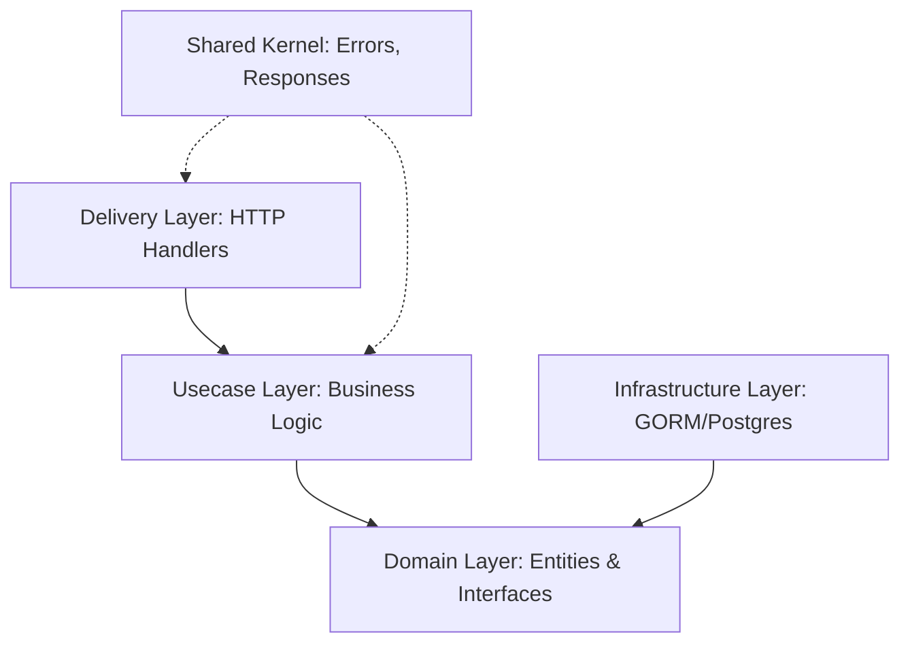

# **GIA Starter App - Clean Architecture**

[](https://golang.org/)
[](LICENSE)
[](https://github.com/)

A professional-grade backend starter kit built with **Golang 1.25** and the **Gin Gonic** framework. This project follows the **Modular Clean Architecture** (Hexagonal Architecture) pattern, designed for high scalability, maintainability, and testability.

---

## 🚀 Tech Stack

| Component      | Technology                                                 | Purpose                               |
| :------------- | :--------------------------------------------------------- | :------------------------------------ |
| **Language**   | [Go 1.25+](https://golang.org/)                            | Core programming language             |
| **Framework**  | [Gin Gonic](https://gin-gonic.com/)                        | High-performance HTTP routing         |
| **ORM**        | [GORM](https://gorm.io/)                                   | Database interaction and mapping      |
| **Database**   | [PostgreSQL](https://www.postgresql.org/)                  | Relational data persistence           |
| **Migration**  | [sql-migrate](https://github.com/rubenv/sql-migrate)       | Database schema version control       |
| **Config**     | [Viper](https://github.com/spf13/viper)                    | Multi-format configuration management |
| **Logging**    | [Uber Zap](https://github.com/uber-go/zap)                 | Fast, structured logging              |
| **Docs**       | [Swagger](https://github.com/swaggo/swag)                  | Automatic API documentation           |
| **Validation** | [Go Validator](https://github.com/go-playground/validator) | Request data validation               |
| **Dev Tool**   | [Air](https://github.com/cosmtrek/air)                     | Live reloading during development     |

---

## 🛠️ Getting Started

### Prerequisites

- **Go 1.25+** installed
- **PostgreSQL** instance running
- **sql-migrate** installed: `go install github.com/rubenv/sql-migrate/...@latest`
- **swag** installed: `go install github.com/swaggo/swag/cmd/swag@latest`

### Environment Configuration

The application uses resilient configuration loading, searching for `.env` and `configs/config.yaml` automatically.

**`.env` variables:**

| Variable      | Description                | Example      |
| :------------ | :------------------------- | :----------- |
| `DB_HOST`     | Database server address    | `localhost`  |
| `DB_PORT`     | Database port              | `5432`       |
| `DB_USER`     | Database username          | `postgres`   |
| `DB_PASSWORD` | Database password          | `secret`     |
| `DB_NAME`     | Database name              | `gin_app_db` |
| `DB_SSLMODE`  | SSL Mode (disable/require) | `disable`    |

### Installation & Run

1. **Clone & Install Dependencies**

   ```bash
   go mod tidy
   ```

2. **Initialize Database**

   ```bash
   make migrate-up
   ```

3. **Run Application**
   ```bash
   go run cmd/api/main.go
   # OR with hot-reload
   air
   ```

---

## 📂 Project Structure

```text
gia-starter-app-V1/
├── cmd/                # Entry points
│   └── api/main.go     # Minimal entry point (calls bootstrap)
├── internal/           # Private code
│   ├── bootstrap/      # App & Module registration
│   ├── modules/        # Feature modules (Domain, Usecase, Interface)
│   ├── delivery/http/  # Global router & transport
│   ├── shared/         # Cross-cutting concerns (Errors, Middleware, Responses)
│   └── infrastructure/ # Technical implementations (DB, Logger, Config)
├── configs/            # Configuration files (YAML)
├── migrations/         # SQL migration scripts
├── pkg/                # Public shared libraries
└── docs/               # Generated Swagger documentation
```

---

## 🏗️ Architecture Design

This kit follows **Clean Architecture** principles, ensuring that business logic is isolated from technical details.

### Core Principles

1. **Independence**: Logic doesn't depend on frameworks or databases.
2. **Layered Structure**: Arrows point inward (Infrastructure/Delivery -> Usecase -> Domain).
3. **Modular DI**: Each module manages its own dependencies via a `module.go` initializer.



---

## 📜 Makefile Commands

| Command                     | Description                   |
| :-------------------------- | :---------------------------- |
| `make migrate-status`       | View current migration status |
| `make migrate-up`           | Apply all pending migrations  |
| `make migrate-down`         | Rollback the last migration   |
| `make migrate-new name=...` | Create a new migration file   |

---

## 📚 API Documentation

Access the Swagger UI at: [http://localhost:8081/swagger/index.html](http://localhost:8081/swagger/index.html)

To update labels or add endpoints:

```bash
swag init -g cmd/api/main.go
```

---

## 📄 License

This project is licensed under the **MIT License**. See the [LICENSE](LICENSE) file for details.
